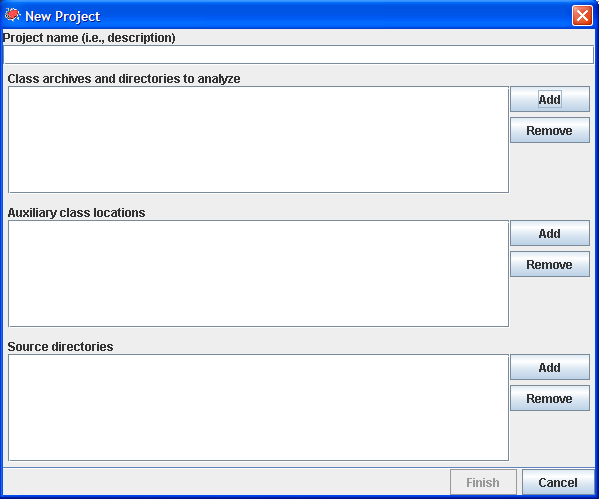
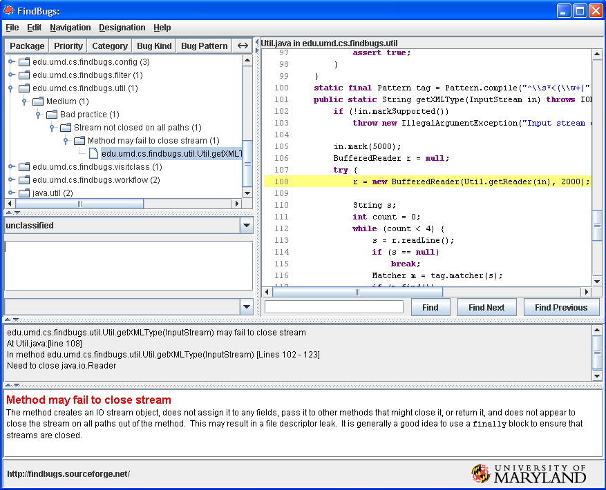

Using the SpotBugs GUI
======================

This chapter describes how to use the SpotBugs graphical user interface (GUI).

Creating a Project
------------------

After you have started SpotBugs using the ``spotbugs`` command, choose the ``File → New Project`` menu item.
You will see a dialog which looks like this:

Use the "Add" button next to "Classpath to analyze" to select a Java archive file (zip, jar, ear, or war file) or directory containing java classes to analyze for bugs. You may add multiple archives/directories.

You can also add the source directories which contain the source code for the Java archives you are analyzing. This will enable SpotBugs to highlight the source code which contains a possible error. The source directories you add should be the roots of the Java package hierarchy. For example, if your app is contained in the ``org.foobar.myapp`` package, you should add the parent directory of the org directory to the source directory list for the project.

Another optional step is to add additional Jar files or directories as "Auxiliary classpath locations" entries. You should do this if the archives and directories you are analyzing have references to other classes which are not included in the analyzed archives/directories and are not in the standard runtime classpath. Some of the bug pattern detectors in FindBugs make use of class hierarchy information, so you will get more accurate results if the entire class hierarchy is available which FindBugs performs its analysis.

Running the Analysis
--------------------

Once you have added all of the archives, directories, and source directories, click the "Analyze" button to analyze the classes contained in the Jar files. Note that for a very large program on an older computer, this may take quite a while (tens of minutes). A recent computer with ample memory will typically be able to analyze a large program in only a few minutes.

Browsing Results
----------------

When the analysis completes, you will see a screen like the following:

The upper left-hand pane of the window shows the bug tree; this is a hierarchical representation of all of the potential bugs detected in the analyzed Jar files.

When you select a particular bug instance in the top pane, you will see a description of the bug in the "Details" tab of the bottom pane. In addition, the source code pane on the upper-right will show the program source code where the potential bug occurs, if source is available. In the above example, the bug is a stream object that is not closed. The source code window highlights the line where the stream object is created.

You may add a textual annotations to bug instances. To do so, type them into the text box just below the hierarchical view. You can type any information which you would like to record. When you load and save bug results files, the annotations are preserved.

Saving and Opening
------------------

You may use the ``File → Save as...`` menu option to save your work. To save your work, including the jar file lists you specified and all bug results, choose "FindBugs analysis results (.xml)" from the drop-down list in the "Save as..." dialog. There are also options for saving just the jar file lists ("FindBugs project file (.fbp)") or just the results ("FindBugs analysis file (.fba)"). A saved file may be loaded with the ``File → Open...`` menu option.
